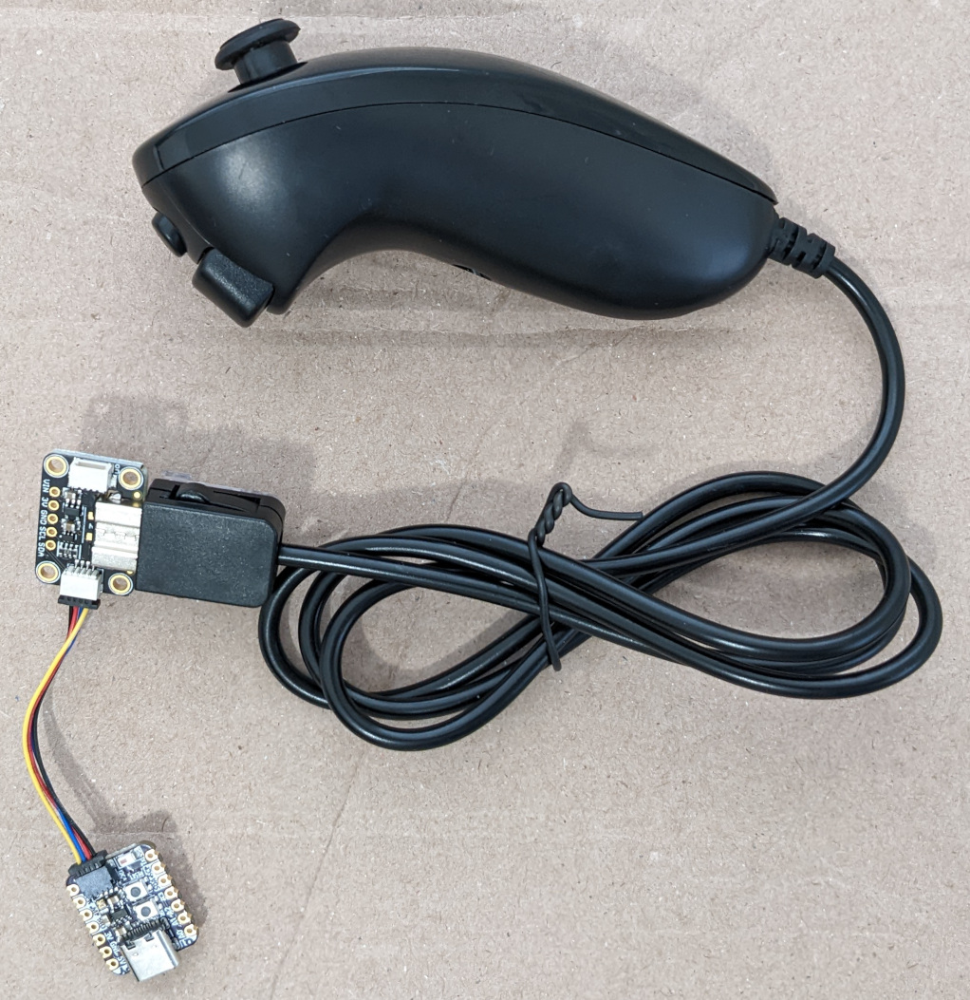
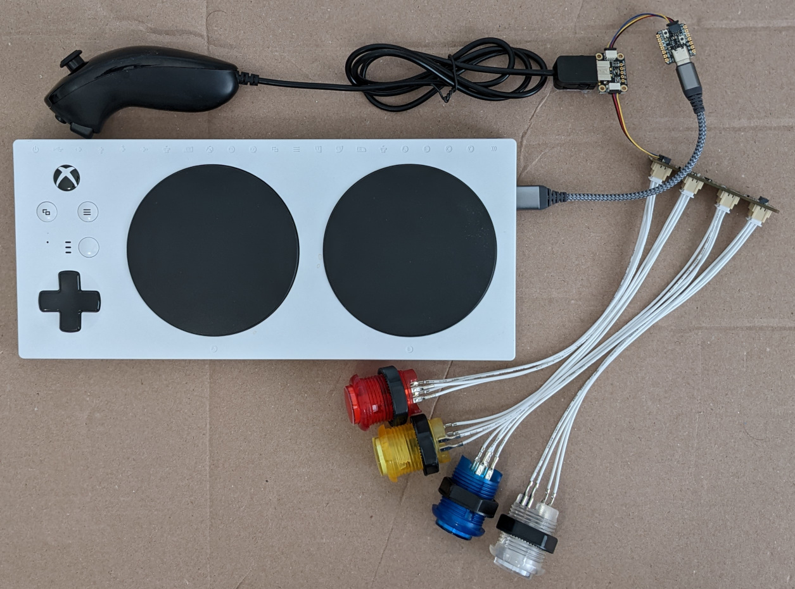

# Convert Wii Nunchunk to USB Joystick without soldering




## Hardware

This project uses the same hardware as https://github.com/esp32beans/USBnunchuck_mouse.

* Adafruit QT Py ESP32-S3 with STEMMA QT, no PSRAM
* Adafruit QT Py RP2040
* Adafruit Trinkey QT2040 - RP2040 USB Key with Stemma QT
* Adafruit Feather RP2040
* Adafruit STEMMA QT/Qwiic JST SH 4-pin cable
* Adafruit Wii Nunchuck Breakout Adapter - Qwiic/STEMMA QT
* Adafruit Wii controller (Nunchuck/Wiichuck)
* USB cable with Type C connector for the ESP32-S3 and the appropriate connector for your computer.

Plug the boards together as shown below. No soldering is needed.

Only one of the QT Py, Trinkey, and Feather boards is needed. The Trinkey is
the cheapest. The RP2040 boards do not have WiFi or Bluetooth so are cheaper
and use much less power.

The ESP32-S3 includes WiFi and Bluetooth Low Energy which are not currently
used but might be in the future. The ESP32-S3 requires powering the XAC using a
wall adapter because the ESP32 uses much more current than the other boards.
The arcade buttons currently do not work on this board.

```
ESP32-S3 --STEMMA-- Nunchuck adapter -- Nunchuck controller
QT Py RP2040 --STEMMA-- Nunchuck adapter -- Nunchuck controller
Trinkey QT2040 --STEMMA-- Nunchuck adapter -- Nunchuck controller
Feather RP2040 --STEMMA-- Nunchuck adapter -- Nunchuck controller
```

Add four 30mm arcade buttons so the joystick has a total of six buttons. Still no
soldering. The arcade button board is sold without the buttons and cables.

* Adafruit LED Arcade Button 1x4 - STEMMA QT I2C Breakout - STEMMA QT / Qwiic
* Adafruit STEMMA QT/Qwiic JST SH 4-pin cable
* 4 X Arcade Button with LED - 30mm
* Arcade Button Quick-Connect Wire Pairs - 0.11" (10 pack)

## Tutorials

Recommended only if you want to change the Python code. Or if you are new to
CircuitPython. The first four guides include instructions on how to install
CircuitPython on the respective boards.

* [Adafruit QT Py ESP32-S3](https://learn.adafruit.com/adafruit-qt-py-esp32-s3)
* [Adafruit QT Py RP2040](https://learn.adafruit.com/adafruit-trinkey-qt2040)
* [Adafruit Trinkey QT2040](https://learn.adafruit.com/adafruit-qt-py-2040)
* [Adafruit Feather RP2040](https://learn.adafruit.com/adafruit-feather-rp2040-pico)
* [Customizing USB Devices in CircuitPython](https://learn.adafruit.com/customizing-usb-devices-in-circuitpython/hid-devices)
* [Adafruit Wii Nunchuck Breakout Adapter](https://learn.adafruit.com/adafruit-wii-nunchuck-breakout-adapter)

This guide is for the arcade button board.

* [Adafruit LED Arcade Button 1x4 STEMMA QT](https://learn.adafruit.com/adafruit-led-arcade-button-qt)

## CircuitPython files

code.py is a renamed copy of nunchuk.py.

CircuitPython files and directories

```
CIRCUITPY/
├── boot_out.txt
├── boot.py
├── code.py
├── hid_joystick.py
└── lib
    ├── adafruit_bus_device
    │   ├── i2c_device.mpy
    │   ├── __init__.py
    │   └── spi_device.mpy
    ├── adafruit_hid
    │   ├── consumer_control_code.mpy
    │   ├── consumer_control.mpy
    │   ├── __init__.mpy
    │   ├── keyboard_layout_base.mpy
    │   ├── keyboard_layout_us.mpy
    │   ├── keyboard.mpy
    │   ├── keycode.mpy
    │   └── mouse.mpy
    ├── adafruit_motor
    │   ├── __init__.mpy
    │   ├── motor.mpy
    │   ├── servo.mpy
    │   └── stepper.mpy
    ├── adafruit_nunchuk.mpy
    ├── adafruit_pixelbuf.mpy
    └── adafruit_seesaw
        ├── analoginput.mpy
        ├── attiny8x7.mpy
        ├── crickit.mpy
        ├── digitalio.mpy
        ├── __init__.py
        ├── keypad.mpy
        ├── neopixel.mpy
        ├── pwmout.mpy
        ├── robohat.mpy
        ├── rotaryio.mpy
        ├── samd09.mpy
        ├── seesaw.mpy
        └── tftshield18.mpy
```

## Testing

Works on XBox Adaptive Controller.
